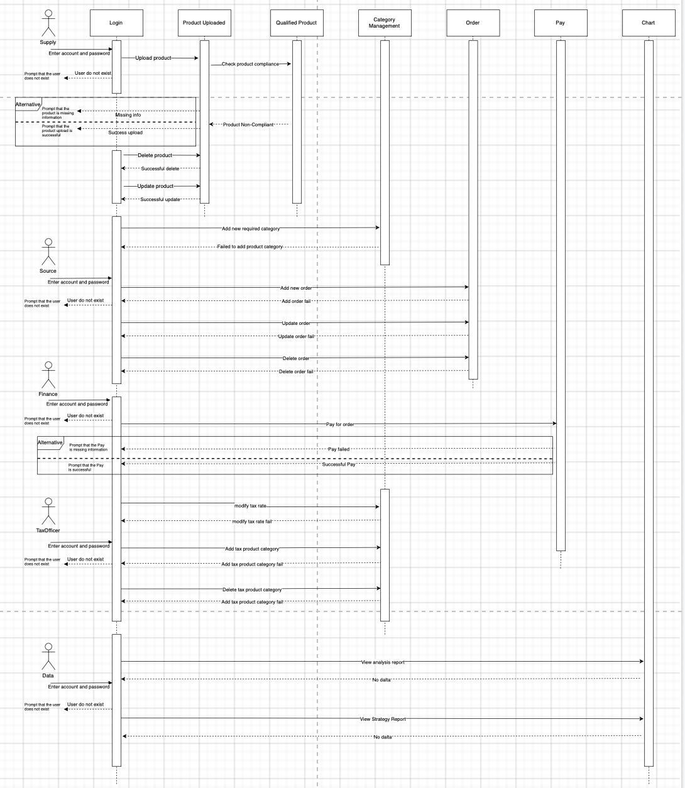

# Term Project Brief

### Problem Solved：

**Background:**  Supply Chain is very important for any companies. An adaptable system that allows proper inventory plan can  contribute to the overall value of the business long term. But It is challenging that make all departments work together and keep information identical.

**Objective:**  This project aims to build a supply chain inventory management platform, which keeps supply & demand information passing among through different departments. It also allows data visualisation to align information with High Management level.

### Project Scale：

There are 4 operational enterprises (Supply, Sourcing, Finance, and Data) + a System enterprise which includs Admin

**Organization:** 9 organizations

**Roles:** 11 roles

**Working Requests:**  9 Working Requests Intotal

>( CRUD User, CRUD Product, Update Product Quality Status, Place an order, CRUD a demanding category, Add Tax rate for a category, Set payment for an order, View Analysis Dashboard,  View Strategy Dashboard)

**Database Used:** MySQL 

### UML Case Modelling

Detials in the presentation slides [Link][https://docs.google.com/presentation/d/1a9e6gEYaD0UUziV6Nl2MkX0FqiEnUolCvnCOXC-Z0cI/edit?usp=sharing]

### UML Class Diagram

### UML Sequence Diagram

