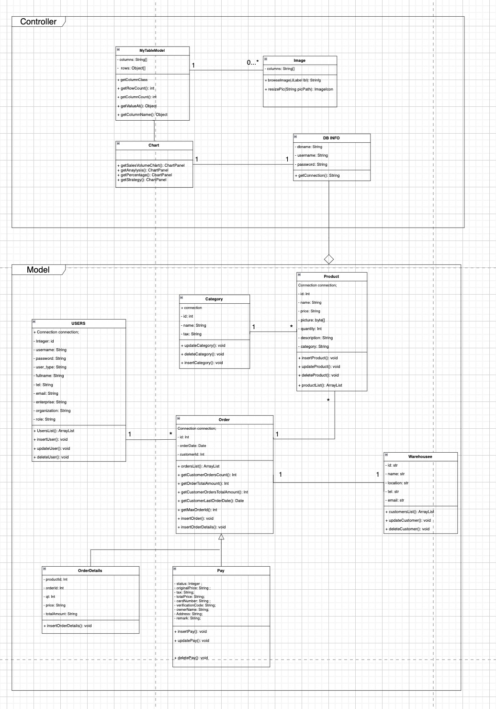

# Term Project Brief

### Problem Solved：

The project aims to build an supply chain inventory management platform, which keeps supply & demand information identical among different departments.

### Project Scale：

There are 4 operational enterprises (Supply, Sourcing, Finance, and Data) + a System enterprise which includs Admin

**Organization:** 9 organizations

**Roles:** 11 roles

**Working Requests:**  9 Working Requests Intotal

>( CRUD User, CRUD Product, Update Product Quality Status, Place an order, CRUD a demanding category, Add Tax rate for a category, Set payment for an order, View Analysis Dashboard,  View Strategy Dashboard)

**Database Used:** MySQL c

### UML Class Diagram

Class Diagram

###UML Sequence Diagram

